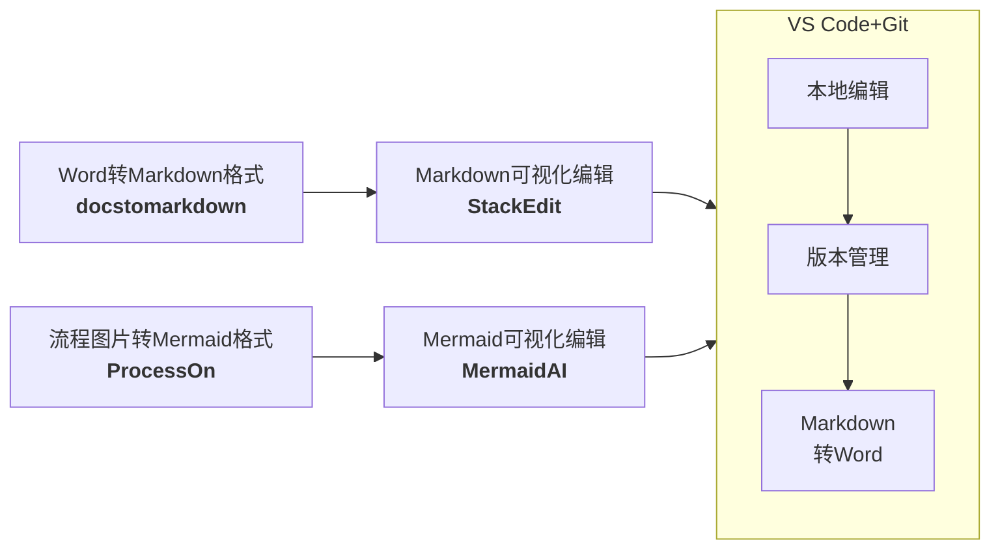
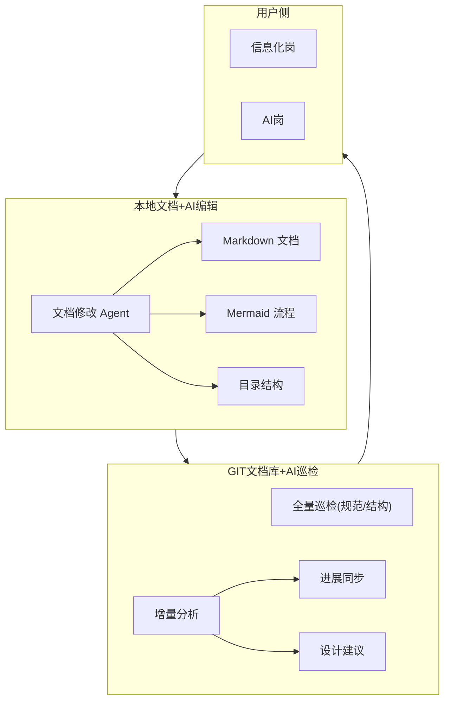

# MilkySea
> This is not a documentation tool, but a **IT/BA documentation paradigm for the AI era**.
> 
AI-friendly enterprise documentation framework using Markdown, Mermaid, Git, and AI Agents to make business processes and system design machine-readable, versionable, and automatable.

❌Word+Visio+SVN   ❌FeishuDoc+EmbeddedFigure+EditHistory   ✅️Markdown + Mermaid + Git + AI Agent


# **AI友好的信息化文档(流程,设计,UI,数据模型)**

> **一句话目标**
> 
> 构建“AI友好”的企业信息化文档，使流程、设计与数据模型可被AI识别、复用，让AI可以参与管理。
> 
> **要解决的问题**
> 
> 当前企业信息化文档存在：
> 
> ❌ 流程图Visio/PPT/云文档内嵌，无法被AI准确理解、或多模态token多，AI无法继续编辑
> 
> ❌ Word/云文档结构松散，AI解析token多，AI无法继续编辑
> 
> ❌ 无法识别出近期的更新内容，无法进行AI自动检查与复用
> 
> **MVP方案思路**
>
> 用“纯文本 + 结构化语法 +> Git”替代传统文档体系
> 
> 核心组合✅️：Markdown + Mermaid + Git + AI Agent

# 企业知识结构分层

## 文档工具迭代

| 时代 | 基于 | 常见格式 | 版本控制 | AI解析 | AI编辑 |
| --- | --- | --- | --- | --- | --- |
| 本地 | Office生态 | JPG,PPT | 🔴SVN,无diff | 🔴难/多模态 | 🔴不可 |
| 云 | 云私有格式 | 微信云,飞书云 | 🟡云文档历史 | 🟡云厂商AI | 🟡有限 |
| AI | 纯文本协议 | MD,Mermaid | 🟢GIT(diff) | 🟢自定AI | 🟢完全 |

## 企业知识构成

| 企业知识 | 用途 | 特点 | 常见格式 | 时代 |
| --- | --- | --- | --- | --- |
| 对外文档 | 宣传/协议 | 通用，艺术 | JPG,Word | 本地 |
| 办公文档 | 协作/工作 | 格式，协作 | 微信云文件夹,Word | 云 |
| 信息化文档 | 流程/逻辑/结构 | 抽象，设计 | 飞书云文档,Word | 云 |
| 程序代码 | 系统实现 | 执行 | Java, python | AI |

## 信息化文档的构成

|  | 产品设计 | 业务流程 | UI设计 | 数据结构/API |
| --- | --- | --- | --- | --- |
| 本地 | Word | Visio/PPT | BMP/PPT | Excel+Visio |
| 云 | 飞书文档 | 飞书内嵌图 | Axure/墨刀 | 飞书内嵌表 |
| AI | Markdown | Mermaid | HTML原型 | Mermaid AST |

# AI友好的信息化文档

本次聚焦于：

| 产品设计 | 业务流程 |
| --- | --- |
| Markdown | Mermaid |

## 文件格式与编辑工具


|  | 语法 | 转换入 | 在线编辑 | 本地编辑+Git | 转换出 |
| --- | --- | --- | --- | --- | --- |
| 逻辑设计 | Markdown | Word to Markdown Converter | https://stackedit.io/app# | VSCode插件Markdown All in One + Markdown Preview Enhanced附件/截图在编辑器内粘贴，即可自动放入同级目录并被引用 | VSCode插件Markdown to Word图片自动渲染到Word中 |
| 业务流程 | Mermaid | 图片→Mermaidhttps://www.processon.com/mermaid | https://mermaid.ai/live/edit点击edit visually |
| 附件/截图 | 文件-被引用 | 无需 | 无需 |

## 目录结构与版本控制

建立“目录即结构”，AI 可以直接理解层级

```/finance/
  /ap/
    process.md
    data.md
    ui.md
    api.yaml
    截图.jpg
    附件.zip 
```

## AI引入

**文档修改 Agent**

运作于 用户本地电脑。如Workbuddy/Codex。

可在编写时提供建议、直接修改。

**全量巡检 Agent**

运行于 GIT服务器。

格式规范（Markdown）；流程合法性（Mermaid）；目录一致性

**增量分析 Agent**

运行于 GIT服务器。

进展同步：自动总结“本周发生了什么” ，把“代码式变更”翻译为“业务语言”，团队内部知识更新。

设计建议：

横向阅读相关文档

给出结构/流程建议，可能的遗漏、改进是什么

**边界**

仅提供建议

不直接修改



# 未来演进

## 信息化文档

| UI设计 | 数据结构/API |
| --- | --- |
| HTML原型 | Mermaid AST |

## 代码反向生成知识

按相同格式，由自研代码、厂商说明书等 自动补全md知识。
